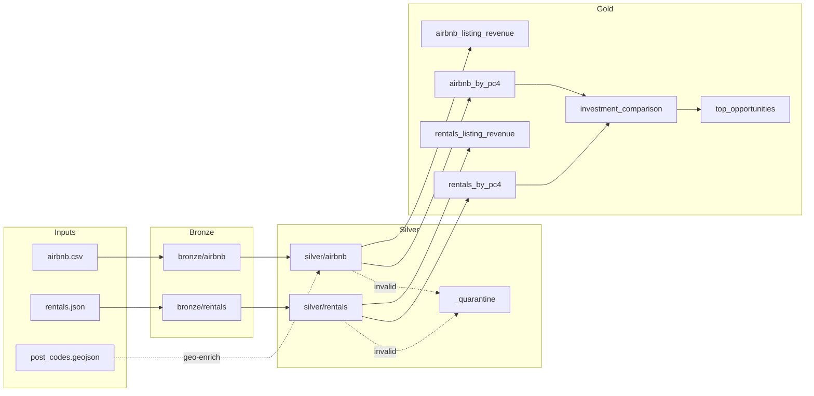
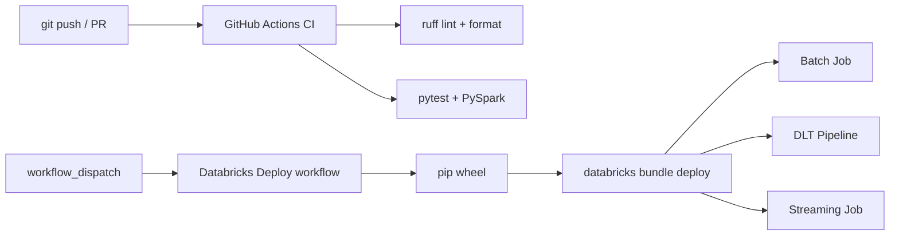
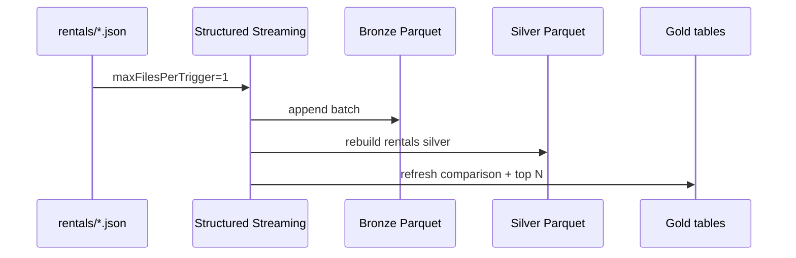

# Architecture & CI diagrams (L2)

## Medallion data flow

## CI/CD pipeline (L1)

## Streaming path (L4)

## DLT expectations (L3)

Quality rules on `silver_airbnb` and `silver_rentals` mirror `src/rent_airbnb/quality.py`:

| Table | Expectation | Action |
|---|---|---|
| silver_airbnb | valid_pc4 | drop |
| silver_airbnb | valid_price (10–5000) | drop |
| silver_airbnb | valid_room_type | drop |
| silver_rentals | valid_rent (200–4000) | drop |
| silver_rentals | valid_pc4 | drop |
| silver_rentals | valid_property_type | drop |

DLT definition: `dlt/rent_airbnb_pipeline.py`
